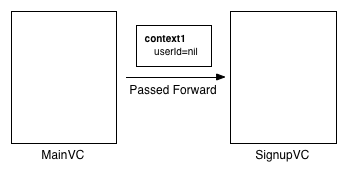
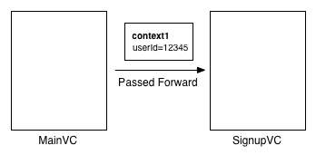
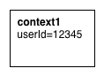
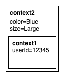
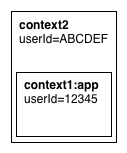

# ControllerContext

ControllerContext solves the problem of passing data back and forth between iOS View Controllers.  The ControllerContext object manages the state between View Controllers, reducing the boilerplate code necessary to wire screens together.

# The problem

The state of the art today for passing data between view controllers is to create properties or setters on the next view controller to display and to use the delegate pattern for passing data back to the originating View Controller.  

Problems with the approach:
- writing code for each data element carried forward
- creating delegate code to pass data elements to the originating View Controller
- difficult to pass data back to the originating View Controller with a multi-level workflow
- no standard way to pass app specific data to every View Controller

# The Solution

What if you could have similar flexibility to how data is passed between Web pages with the ability to control the scope of the data passed around?  The ControllerContext object gives you this power and control for passing data back and forth between View Controllers.

Imagine you have a login View Controller that needs to return the userId.  The INNControllerContext instance is created in the MainVC class and passed to the SignupVC instance by calling the method INN_setContext: on the SignupVC View Controller.  At this point both the MainVC and SignupVC have a reference to the same INNControllerContext instance.



After the user enters a username and password combination the userId could be returned from a remote service call validating the username and password combination.  The SignupVC sets the userId value in the INNControllerContext instance.  Since the same INNControllerContext instance is shared between the MainVC and SignupVC View Controllers the MainVC has access to the userId when viewWillAppear: fires.  This provides MainVC complete control over when to make UI changes based on the current values stored in the INNControllerContext instance.




## The ControllerContext Object

The ControllerContext class is similar to NSDictionary in that you can set, get, and remove keys and their associated objects.  Keys are NSString objects and values are of type id.

A ControllerContext can also be constructed with an innerContext (ControllerContext) instance.  This enables you to build and pass around context objects with layers like an onion.  

First, create an instance of INNControllerContext.

```objective-c
INNControllerContext *context1 = [[INNControllerContext alloc]init];
```

Next, set an object for a key in a similar way you would use a NSMutableDictionary instance.

```objective-c
[context1 setObject:@"12345" forKey:@"userId"];
```



You can retrieve the object associated with a key by calling the objectForKey: method.

```objective-c
userId = [context1 objectForKey:@"userId"];
```

Now create a second ControllerContext passing in context1 as the inner ControllerContext.

```objective-c
INNControllerContext *context2 = [[INNControllerContext alloc]initWithInnerContext:context1];
```

When setObject:forKey: is called, the key/object pair is stored in the outer most ControllerContext instance referenced.  In the example below the “color” and “size” objects are stored in the context2 instance.  

If the same key was set in a inner ControllerContext, the outer most object will be returned when calling objectForKey:.

```objective-c
[context2 setObject:@"Blue" forKey:@"color"];
[context2 setObject:@"Large" forKey:@"size"];
```


When objectForKey: is called, the logic starts at the outer most ControllerContext instance and walks the inner ControllerContext chain until the first matching key is found.  It then returns the object associated with the key.  If the inner ControllerContext ends with a nil the value nil is returned.

In the example below, the “userId” object will be returned by the inner ControllerContext, which was defined above with the context1 instance.  Both “color” and “size” will return their objects from the context2 instance.

```objective-c
userId = [context2 objectForKey:@"userId"];
color = [context2 objectForKey:@"color"];
size = [context2 objectForKey:@"size"];
```

The ControllerContext instance method dumpToConsole logs to the console the entire ControllerContext hierarchy.  The console output contains the optional ControllerContext name, the hierarchy level, and the key/object pair. 

```objective-c
---------------
1:--- (null) ---
1:color = Blue
1:Size = Large
0:--- (null) ---
0:userId = 12345
---------------
```

## Naming the ControllerContext

When creating a new ControllerContext instance you can provide a name.  The name can be used when setting, getting, or removing key/object pairs to target a specific ControllerContext.  You might use this method to guarantee you are accessing keys that were created with a specific name such as “app” or “base.” 

```objective-c
context1 = [[INNControllerContext alloc]initWithName:@"app"];

[context1 setObject:@"12345" forKey:@"userId"];
  
...
  
context2 = [[INNControllerContext alloc]initWithInnerContext:context1];  // context2 → context1

[context2 setObject:@"ABCDEF" forKey:@"userId"];

userId = [context2 objectForKey:@"userId"] // object returned is “ABCDEF” from context2

userId = [context2 objectForKey:@"userId" withContextName:@"app"];  // object returned is “12345” from context1
```


## Using ControllerContext with View Controllers

The category UIViewController (INNControllerContext) is provided to manage the INNControllerContext instance associated with a View Controller instance.   You can use the methods INN_setContext: and INN_context to set and retrieve the INNControllerContext instance.

```objective-c
@interface UIViewController (INNControllerContext)

-(id) INN_initWithContext:(INNControllerContext *)context;
-(void) INN_setContext:(INNControllerContext *)context;
-(INNControllerContext *)INN_context;

@end
```

Below is an example of creating the first INNControllerContext instance and passing it forward to the next View Controller.

```objective-c
ColorsVC *vc = [[ColorsVC alloc]init];
  
colorContext = [[INNControllerContext alloc]init];
[vc INN_setContext:colorContext];
  
[self.navigationController pushViewController:vc animated:YES];
```

Below is an example of chaining INNControllerContext instances by retrieving the current INNControllerContext instance from self.INN_context.

```objective-c
SizeVC *vc = [[ColorsVC alloc]init];
  
sizeContext = [[INNControllerContext alloc] initWithInnerContext:self.INN_context];
[vc INN_setContext:sizeContext];
  
[self.navigationController pushViewController:vc animated:YES];
```

The suggested location to retrieve values from the INNControllerContext is in the viewWillAppear: method.  This enables the evaluation of the INNControllerContext data before the View Controller is displayed.

```objective-c
-(void) viewWillAppear:(BOOL)animated{
  [super viewWillAppear:animated];

  if(sizeContext!=nil){
    NSString *newSize = [sizeContext objectForKey:@"size"];
    if(newSize!=nil){
      //
      // assign data from context to an instance field
      //
      size = newSize;
      
      //
      // update UI here
      //
    }
    
    //
    // you can nil out sizeContext so this section of code is only evaluated when sizeContext has been set
    //
    sizeContext = nil;
  }
}
```

## ControllerContext  Rules

It’s important to know the rules behind how the ControllerContext manages its internal data.

- a ControllerContext can only reference one inner ControllerContext
- by default the key/object pair will be stored or removed from the ControllerContext referenced
- the retrieval of an object by key will traverse the ControllerContext chain walking through inner ControllerContext references until the first key is found or a nil inner 
ControllerContext is reached
- if referenced by name, the set, get, or remove actions will only by executed on the ControllerContext with the matching name
- if multiple ControllerContext instances have the same name, the top most ControllerContext will be used
- an object can be nil for a given key
- a key cannot be nil

## Usage

### Example App

Have a look at the /Example folder.

## Requirements

Designed for iOS 6.0 and above, but I see no reason this shouldn't work with OSX 10.8 and above.

## Current Version

Release 0.1.0

## Installation

CocoaPods coming soon...

For now drop the files in the Classes folder into your project.

## TODO

## Author

Michael Raber, michael@innoruptor.com, [@michaelraber]

## License

ControllerContext is available under the BSD license. See the LICENSE file for more info.

[@michaelraber]:http://twitter.com/michaelraber
